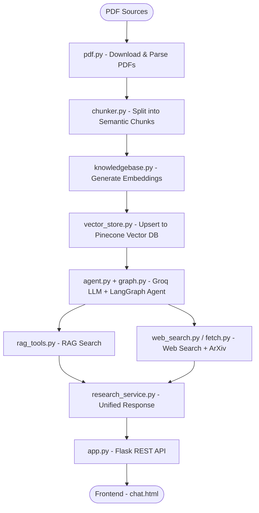
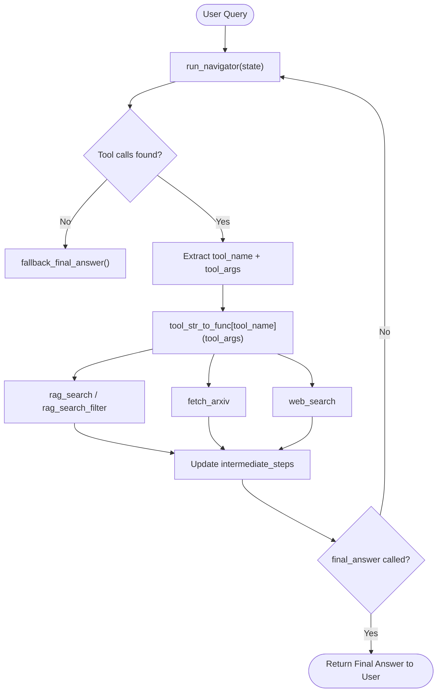

# AI BASED RESEARCH ASSISTANT AGENT 

## An intelligent research assistant that ingests PDF documents, indexes them in a Pinecone vector database, and uses a Groq-powered agentic pipeline to answer research queries with deep accuracy. Features ArXiv fetching, web search fallback, RAG-based retrieval, and a full-stack web frontend with authentication.

## How it works:

## Features
PDF Ingestion — Downloads and parses PDFs from URLs or local files

Semantic Chunking — Splits documents into meaningful overlapping chunks for better retrieval

Vector Embeddings — Converts chunks into dense embeddings and stores them in Pinecone

RAG Search — Retrieves the most relevant chunks based on semantic similarity to a query

ArXiv Integration — Directly fetches academic papers from ArXiv by query or paper ID

Web Search Fallback — Falls back to live web search when the knowledge base lacks relevant data

Groq LLM Agent — Fast, accurate responses powered by Groq's inference API 

LangGraph Orchestration — Structured agent execution graph for reliable multi-step reasoning

Auth System — JWT-based login/signup with protected routes

Chat UI — Clean, responsive multi-turn chat interface

## Agent Execution Flow 

